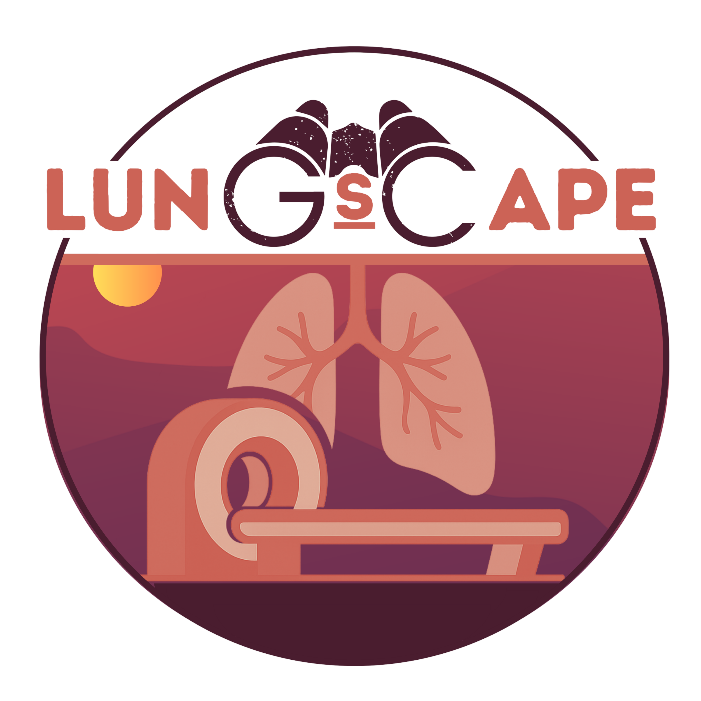

# LungScape - Lung CT Segmentation Pipeline
Alberto Arrigoni - Istituto di Ricerche Farmacologiche Mario Negri IRCCS



## Overview

This pipeline performs comprehensive segmentation of lung structures from chest CT scans, including:
- **Airways** and trachea
- **Pulmonary vessels**, also classified by diameter
- **Lung lobes** and fissures
- **Pathological tissues**: reticulation/consolidations, ground glass opacities (GGO), air trapping
- **Regional anatomical analysis**: Superior-Inferior, Posterior-Anterior, Left-Right divisions, and lobe-based analysis

## Project Structure

```
LungScape/
├── LungScape.m    		# Main script
├── README.md                  # This file
├── config/
│   └── getProcessingParameters.m     # Centralized parameter management
├── io/
│   ├── loadPatientData.m             # Load patient dataset information
│   ├── loadPatientVolumes.m          # Load NIfTI volumes
│   └── saveResults.m                 # Save segmentation results
├── preprocessing/
│   ├── preprocessLungs.m             # Erode margins, separate L/R lungs
│   ├── refineLobeSegmentation.m      # Fill gaps in lobe segmentation
│   └── classifyDistanceFromBorder.m  # Distance-based parenchyma classification
├── segmentation/
│   ├── segmentAirways.m              # Airway segmentation and refinement
│   ├── createRegionalMaps.m          # Regional anatomical divisions
│   └── createLabelMap.m              # Combine all segmentations
├── postprocessing/
│   └── (refinement functions)
└── utils/
    ├── computeFractionalAnisotropy.m         # Calculate FA from eigenvalues
    ├── filterByAnisotropy.m                  # Filter by FA threshold
    ├── filterByEigenVectorOrientation.m      # Filter by orientation
    ├── reconstructBySeeds.m                  # Morphological reconstruction
    └── computeVesselDiameter.m               # Compute diameter maps
```

## Quick Start

### 1. Setup

Ensure you have the required dependencies:
- TotalSegmentator
- MATLAB R2019b or later
- Image Processing Toolbox
- NIfTI toolbox (`load_untouch_nii`)
- `anisodiff3D` function
- `vesselness3D` function (Jerman filter)
- `nrrdWriter` function

### 2. Prepare Data

TotalSegmentator and the provided python scripts (runTotalSegmentator.py and aggregateLobes.py) are required to generate the input resources.
Organize your input in the following structure (
```
Input Data Structure (per patient):
   DATA/Patient001/
       ├── Patient001/
       │   ├── Patient001.nii.gz              (CT volume)
       │   ├── Patient001_lobesTS.nii.gz      (Lobes coarse segmentation)
       │   ├── Patient001_lungsTS.nii.gz      (Lungs coarse segmentation)
       │   ├── Patient001_vesselsTS.nii.gz    (Vessels coarse segmentation)
       │   ├── Patient001_airwaysTS.nii.gz    (Airways coarse segmentation)
       │   ├── Patient001_consolidation.nii.gz
       │   ├── Patient001_HighAttenuation.nii.gz
       └── Patient002/
           └── ...
```

### 3. Run Pipeline

```matlab
% Navigate to the directory containing LungScape.m and run the script

```

### 4. View Results

Results are saved to `<PatientFolder>/InterimResults/`:
- **TotalLabelMap.nrrd** - Complete segmentation with labels
- **Vol_<Patient>.nrrd** - Processed CT volume
- **<Patient>.mat** - MATLAB workspace with all variables

## Label Map Values

The final segmentation label map uses the following encoding:

| Label | Structure | Description |
|-------|-----------|-------------|
| 0 | Background | Outside lungs |
| 1 | Healthy parenchyma | Normal lung tissue |
| 2 | GGO | Ground glass opacity |
| 3 | Reticulation/Consolidation | Dense opacification |
| 4 | Air trapping | Cysts, honeycombing, air-filled pathology |
| 5 | Small/medium vessels | Diameter ≤ 6mm |
| 6 | Airways | Bronchi |
| 7 | Trachea | Main airway |
| 8 | Large vessels | Diameter > 6mm |
| 9 | Airway walls | Bronchial walls |
| 10 | Trachea walls | Tracheal walls |

## Strenghts
- All the hyperparameters are in `getProcessingParameters()`
- Comprehensive documentation for each function
- Clear function signatures and examples
- Input validation in all functions
- Error handling with informative messages
- Patient-level error isolation
- Descriptive variable names
- Structured outputs
- Progress reporting at each step

### Adjusting Parameters

Edit `config/getProcessingParameters.m` to modify:
- **Filtering**: Anisotropic diffusion settings
- **Thresholds**: HU values for different tissues
- **Airways**: Honeycomb detection, anisotropy thresholds
- **Vessels**: Vesselness thresholds, diameter classification
- **Morphology**: Structuring element sizes

## Development Notes

### Current Implementation Status

✅ **Completed**:
- Core infrastructure (config, I/O, utils)
- Lung preprocessing and regional analysis
- Basic airway segmentation
- Label map creation and saving

⚠️ **Simplified** (from original):
- Airway honeycomb detection (basic version)
- Vessel segmentation (uses TotalSegmentator output)
- Consolidation refinement
- Trachea/bronchi separation

❌ **To be implemented**:
- Complete vessel segmentation pipeline with Jerman filter
- Full airway refinement with graph-based analysis
- Vessel diameter classification
- Fissure segmentation
- Airway/vessel wall segmentation


## Citation

If you use this code, please cite:

```
@software{LungScape,
  author = {Arrigoni, Alberto},
  title = {LungScape - Lung CT Segmentation Pipeline},
  year = {2025},
  github = 
}

Original Paper: Arrigoni, A., Pennati, F., Bonaffini, P.A. et al. Advanced lung segmentation on chest HRCT: comprehensive pipeline for quantification of airways, vessels, and injury patterns. Radiol med (2025). https://doi.org/10.1007/s11547-025-02166-w
```

## License

[Specify license]

## Contact

For questions or issues:
- Original author: Alberto Arrigoni

## Changelog

### Version 2.0 (2026-01)
- **Major refactoring** of original monolithic script
- Modular architecture with organized function library
- Centralized parameter management
- Comprehensive documentation
- Improved error handling and validation

### Version 1.0
- Original implementation by Alberto Arrigoni
